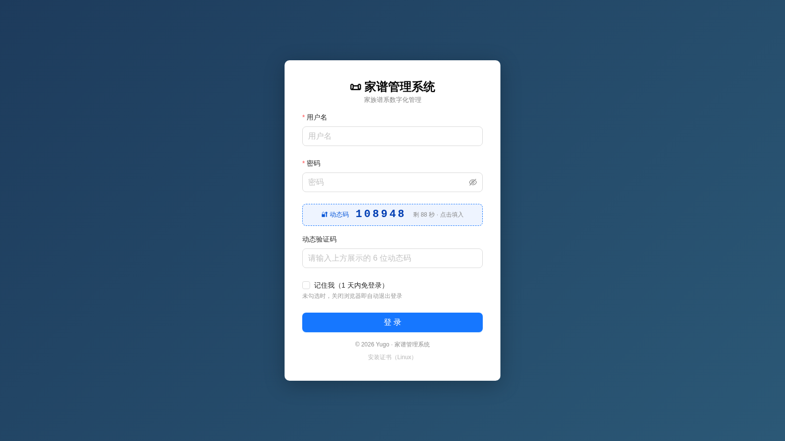
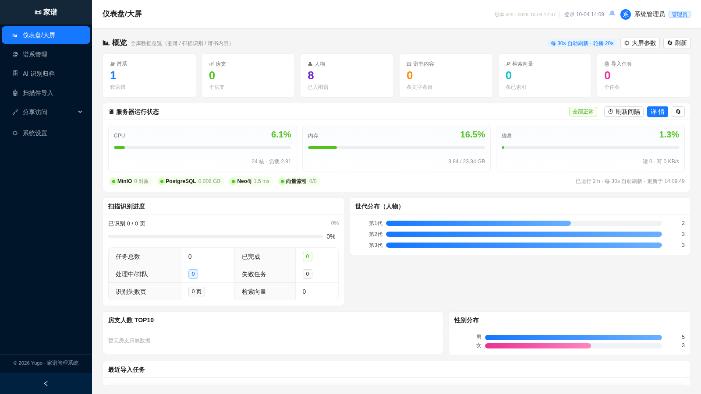
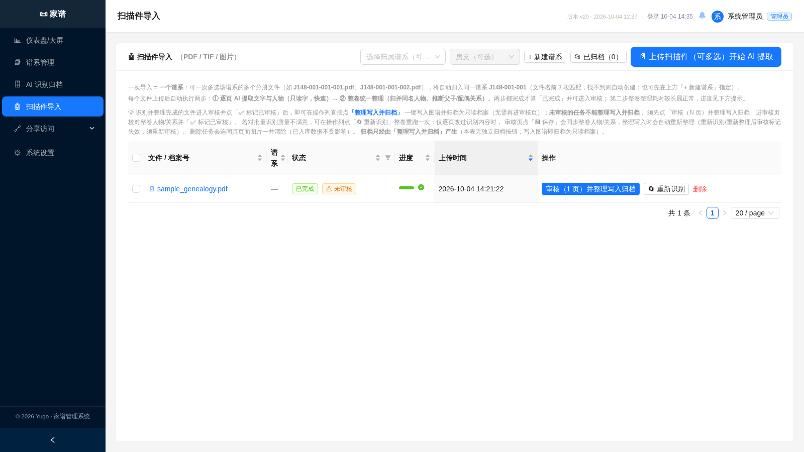

# 家谱（族谱）管理系统

将 PDF/TIF 扫描的老族谱通过**多模态大模型自动识别**（OCR + 人物/关系结构化抽取），经人工审核后写入图谱数据库，提供可视化谱系树、3D 谱系、RAG 智能问答与免登录访客分享。
适用于重影字、横竖排混排、残缺字、古文与手写体等古籍扫描难点场景。

> 英文文档：[README.en.md](README.en.md)

## 功能特性

- **AI 扫描件导入**：批量上传 → 视觉大模型逐页识别 → 人工审核（整卷/逐页）→ 写入图谱，把"手工录入"变成"校对修正"
- **谱系与人物管理**：谱系/房支分级管理；人物信息与父母/配偶关系维护
- **可视化**：AntV G6 二维谱系树 + 3D 力导谱系，子树展开与人物搜索
- **RAG 问答**：向量化 + 精排双阶段检索，管理端与访客端均可用
- **访客分享**：6 位短链，分「谱系分享」与「大屏分享」，免登录看 3D 谱系 / 搜人物 / AI 问答（按项开关）
- **安全**：HOTP 动态码登录、首次登录强制改密、模块级权限、删除审批、操作日志

## 界面预览

| 登录（动态码） | 概览大屏 |
| --- | --- |
|  |  |

| 扫描件导入（AI 识别） |
| --- |
|  |

## 技术架构

```
浏览器 ──https──▶ Nginx(:443) ──┬─ /       → 前端静态（Vue3）
                                 ├─ /api/   → 后端 API(:8000)
                                 └─ /files/ → MinIO(:9000)
后端 ──┬─▶ Neo4j(:7687)     人物 / 关系图谱
       ├─▶ PostgreSQL(:5432) 用户 / 文件元数据 / 任务
       └─▶ MinIO(:9000)     扫描件对象存储
```

- 技术栈：FastAPI (Python 3.11) / Vue3 + Vite + Ant Design Vue / Neo4j 5.26 / PostgreSQL 15 / MinIO / Nginx / Docker Compose
- 只对外暴露 80/443（80 仅自动跳转 HTTPS），其余服务仅容器内互联
- AI 推理（VL 识别 / 向量化 / 精排）不包含在本仓库，为独立部署的 OpenAI 兼容协议服务，地址由 `.env` 配置，可独立升级或整体替换

## 快速部署

前置：Docker + Compose，以及预先部署的外部推理服务（VL / Embedding / Reranker）。

```bash
bash scripts/build-frontend.sh   # 构建前端（node 容器，无需装 Node）
bash scripts/gen-certs.sh        # 生成自签证书（ca.crt 需分发到客户端导入）
cp .env.example .env && vi .env  # 务必修改默认密码与推理服务地址
docker compose up -d --build
```

访问 `https://<服务器 IP>`，默认账号 `admin / admin123`（**首次登录后立即改密**）。
改 `.env` 后必须 `docker compose up -d backend`（`restart` 不会重新注入环境变量），更多调优参数见 [.env.example](.env.example) 注释。

## 数据与迁移

数据全部 bind mount 到 `./data/`（PG / Neo4j / MinIO 扫描件原图）。整目录 + 镜像（`docker save/load`）即可离线迁移到另一台机器。

## 运维

```bash
docker compose logs -f backend   # 后端日志
docker compose restart backend   # 改代码后重启
docker compose up -d backend     # 改 .env 后重建
docker compose down              # 停止（数据保留）
```

> - 重启后端前确认无运行中的识别任务，必要时先暂停
> - 前端构建产物 bind mount 进 Nginx，**不要 `rm -rf dist`**

## Neo4j 数据模型

```
(:Person {name, gender, 生卒年, 籍贯, 世系, 传记, photo, ...})  (:Place)  (:Document)
(:Person)-[:PARENT_OF]->(:Person)      父母→子女
(:Person)-[:SPOUSE_OF {marriage_date}]->(:Person)  配偶
(:Person)-[:HAS_DOCUMENT]->(:Document)
```

## License

MIT（见 [LICENSE](./LICENSE)）：源码可自由使用/修改/分发；代码版权归开发者所有（© 2026 Yugo，AI 编程工具辅助开发）；
系统内录入的族谱数据、扫描件及 AI 识别内容不随源码授权，权利归数据所有者。
